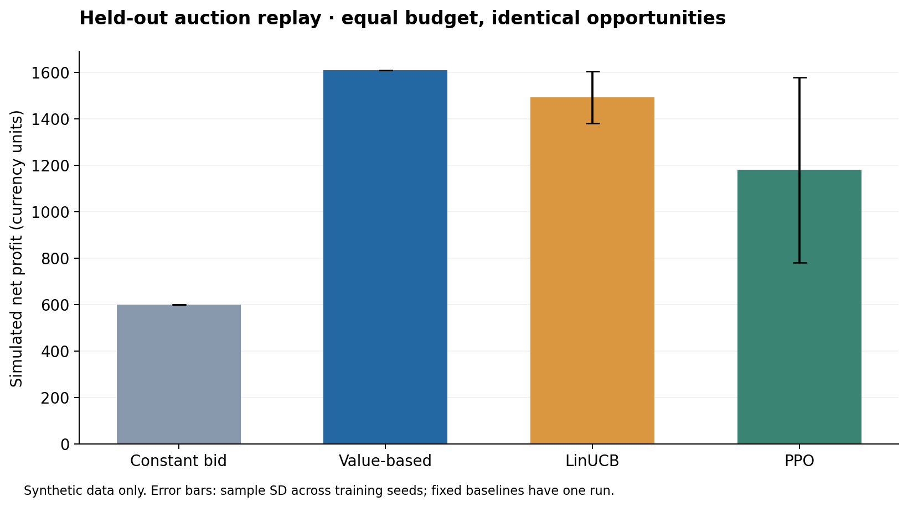
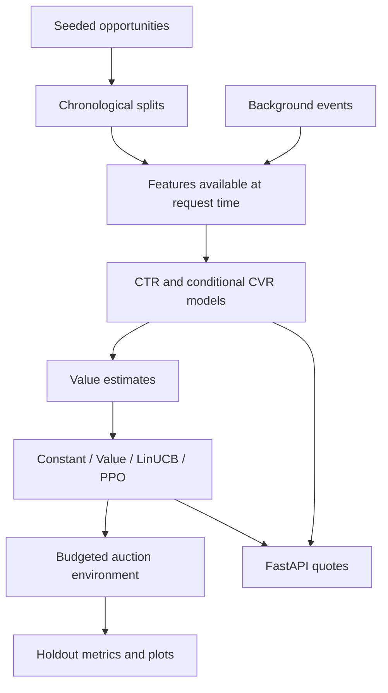

# AuroraBid

**From click prediction to budget-constrained bidding decisions.**

AuroraBid is a reproducible advertising-auction simulator connecting supervised
learning, contextual bandits, reinforcement learning, and an inference API.
It asks: **how should an advertiser bid when opportunities have different
expected values and the campaign has a fixed budget?**

The benchmark uses **fully synthetic data**. It demonstrates modeling and
engineering decisions; it does not measure production revenue or live ad traffic.

[Results](reports/RESULTS.md) · [Design decisions](docs/design.md) ·
[Executed demo](notebooks/demo.ipynb)

## What is implemented

- **CTR and conditional CVR prediction:** logistic regression and gradient-boosted
  trees, selected on validation log loss and evaluated on a chronological holdout.
- **Four strategies:** constant bid, expected-value bidding, disjoint LinUCB,
  and PPO through Stable-Baselines3.
- **A budget-aware Gymnasium environment:** second-price clearing, reserve prices,
  per-auction bid limits, and hard total spending caps.
- **Consistent inference:** one named feature schema shared by training and the
  FastAPI endpoint, with explicit checkpoint validation.
- **Reproducible evidence:** seeded data generation, three policy-training seeds,
  per-run metrics, plots, source/data hashes, tests, and GitHub Actions.

## Results at a glance



The published experiment uses **15,000 opportunities** split chronologically into
9,000 training, 3,000 validation, and 3,000 test examples. Each strategy sees the
same test opportunities and prices, with a **1,050-unit budget**, **5-unit bid
limit**, and **30 units of value per simulated conversion**.

PPO and LinUCB are evaluated without learning, across seeds 42, 43, and 44.
Fixed baselines run once. Error bars describe training-seed variation on one fixed
synthetic holdout. The [complete results](reports/RESULTS.md) include supervised
metrics and every policy, including underperforming policies.

## Run locally

Python 3.11 or 3.12 is recommended. No credentials, external dataset, or GPU is
required. Run commands from the repository root.

```bash
git clone https://github.com/yuxiding/real-time-bidding.git
cd real-time-bidding
python3 -m venv .venv
source .venv/bin/activate
python -m pip install --upgrade pip
python -m pip install -e '.[dev]'
aurorabid reproduce
```

On Linux, install CPU PyTorch **before** installing the project to avoid CUDA downloads:

```bash
python -m pip install torch==2.8.0 --index-url https://download.pytorch.org/whl/cpu
```

The full command writes models, plots, metrics, and a sample API request to
`outputs/`. Committed benchmark outputs are in `reports/`. Runtime and the tested
dependency versions are recorded in [run_metadata.json](reports/run_metadata.json).
For the published direct dependency versions, install with
`python -m pip install -r requirements-repro.txt` instead. Transitive dependencies
are not fully locked; exact floating-point results can vary across platforms.

For a small integration check rather than the published benchmark:

```bash
aurorabid reproduce --output outputs/smoke --rows 2000 --seeds 42 --ppo-steps 512
pytest -q
```

## Try the API

After the full reproduction command:

```bash
uvicorn aurorabid.api:app --host 127.0.0.1 --port 8000
```

In another terminal:

```bash
curl http://127.0.0.1:8000/health
curl -X POST http://127.0.0.1:8000/bid \
  -H 'Content-Type: application/json' \
  --data @outputs/example_request.json
```

Open [interactive API documentation](http://127.0.0.1:8000/docs) to change inputs.
Use `"strategy": "value"` or `"strategy": "ppo"`. Responses contain the request ID,
bid, predicted CTR, and conditional CVR. Missing probability checkpoints stop
startup; missing PPO weights cause an explicit error on PPO requests.

The API returns **stateless quotes**. The caller supplies available history,
remaining budget, and time remaining. Concurrent campaign accounting and auction
settlement are outside this demo. [Docker instructions](deployment/README.md)

## How the pieces fit



| Module | Responsibility |
|---|---|
| `src/aurorabid/data.py` | Seeded opportunities and independent background events |
| `features.py` | Event-time history and shared feature schema |
| `models.py` | Probability modeling, selection, persistence |
| `auction.py`, `environment.py` | Clearing rules, constraints, Gymnasium environment |
| `policies.py`, `evaluation.py` | Policy training and frozen-policy replay |
| `experiment.py`, `cli.py` | End-to-end reproduction and reporting |
| `api.py` | Validated request-to-bid inference |
| `tests/`, `reports/`, `notebooks/` | Regression checks, results, executed walkthrough |

## Modeling choices and limits

- Expected value per impression is `P(click | x) × P(conversion | click, x) × value`.
  CVR trains only on clicked examples. Bid units are currency **per impression**;
  CPM multiplies by 1,000 only when reporting.
- History uses background events strictly before the request. A click becomes
  available at click time, not impression time. Current/future target outcomes
  and clearing prices are excluded from features.
- Learned policies observe remaining budget and time. A shared settlement layer
  enforces caps for every strategy.
- The simulator reveals auction rewards immediately during training, uses
  policy-independent background activity, and assumes an unreactive market.
  Real logged-auction evaluation must address censored outcomes and selection bias.
- Predictive accuracy and decision quality are evaluated separately. Models and
  bid multipliers are selected on validation; the test set is reserved for evaluation.

## References and attribution

PPO optimization is supplied by [Stable-Baselines3](https://github.com/DLR-RM/stable-baselines3)
using [Gymnasium](https://gymnasium.farama.org/). Probability estimators use
[scikit-learn](https://scikit-learn.org/). Project code implements data generation,
event-time features, the auction environment, budget controls, integration,
evaluation, and the API.

- [Li et al., A Contextual-Bandit Approach to Personalized News Article Recommendation](https://arxiv.org/abs/1003.0146)
- [Schulman et al., Proximal Policy Optimization Algorithms](https://arxiv.org/abs/1707.06347)

See [design.md](docs/design.md) for this version's scope and remaining work.
