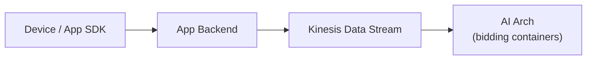
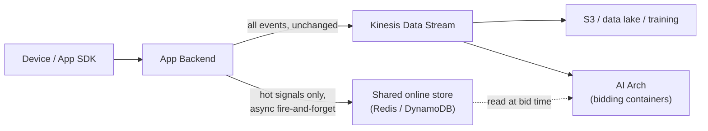

# App data ingestion: alternatives to the Kinesis bridge

**Status:** ideation for standup discussion — not a decision, no code changes implied yet.
**Scope:** how device/app event data reaches the AI Arch (this bidding engine), not a rewrite of the app team's stack.

## Current path

Device → App Backend → Kinesis → AI Arch. Three hops before any event (impression, click,
conversion, spend) can influence a bid. It works — it's a reasonable fallback — but it's worth
asking whether every consumer of this data actually needs to sit behind all three hops.

## The real issue isn't hop count, it's that one pipe serves two different jobs

Looking at what actually consumes app event data in this repo, there are two very different
freshness requirements bundled into a single stream today:

- **Cold path — analytics/training.** `training/offline_rl.py`, `replay_buffer.py`, and the
  CTR/CVR retraining scripts want complete, durable, replayable history. Minutes of lag is fine.
  Kinesis (partitioned, replayable, multi-consumer fan-out) is a genuinely good fit here.
- **Hot path — bid-time state.** `BudgetController.update()` needs spend/impression counters
  current enough that pacing doesn't overshoot within the hour. `LinUCBAgent.update()` /
  `PPOAgent` need click/conversion reward signal to adapt the bidding policy. `LocalFeatureStore`
  needs the freshest available signal for the *next* request from a given user. None of these are
  read once and archived — they're mutated continuously and read at bid time.

Right now the hot-path consumers get their data the same way the cold-path ones do: through
Kinesis, then apparently a batch step, since `config/serving.yaml` refreshes the feature
store/models on a **600-second** interval. That's the actual cost of the current design — not
that Kinesis is slow per se, but that a stream built for durable fan-out is being asked to also
deliver low-latency point updates, and the feature store falls back to a 10-minute-stale batch
refresh to cope. Worth confirming at standup: is 600s already the acceptable freshness bar for
most features, or was it set that way *because* nothing faster was available?

## Proposed direction: split by freshness, don't replace the pipe

Keep Kinesis exactly as-is for the cold path. Add a narrow, additive fast lane for the handful of
signals that actually change a bid decision: spend/pacing counters, recent reward
(click/conversion) signal, and any "just happened" user state.

Mechanically:

1. App Backend keeps writing to Kinesis unchanged — training, analytics, and any other team
   already consuming that stream are unaffected.
2. For the small set of hot-path keys, App Backend additionally makes a direct, async,
   fire-and-forget call (gRPC/HTTP) to a thin ingestion endpoint owned by the AI Arch side, which
   upserts into a shared low-latency store — Redis/ElastiCache is the natural pick, and it's
   already anticipated in the code (`src/features/feature_store.py:6-8` has a commented-out
   `import redis`). `LocalFeatureStore.get_combined_feature()` reads from there instead of
   (or as a first check before) the CSV snapshot.
3. **Fallback is automatic, not a separate mode.** If the fast lane is unreachable or slow, the
   AI Arch simply falls back to whatever it has from the existing Kinesis-fed batch refresh —
   i.e., worst case is exactly today's behavior, never worse. This is a dual-write/best-effort
   pattern, not a cutover, so it can be rolled out one signal at a time (start with budget spend
   counters, since overspend has a clear dollar cost) without any risk to the existing path.

A complementary, even cheaper option for signals that are purely session-local (e.g., "user
dwelled on the last creative," a device/context flag): have the App Backend attach them directly
in the bid-request payload the AI Arch already receives, instead of "ingesting" them out-of-band
at all. Zero ingestion latency by construction, OpenRTB-native, but only works for per-request
data — not cross-session aggregates like cumulative spend or click history, which still need a
shared store.

## Options considered

| Option | Latency win | Effort / risk | Notes |
|---|---|---|---|
| **A. Status quo** (Kinesis → batch refresh) | — | none | Baseline; keep as fallback regardless of what else is chosen. |
| **B. Tune Kinesis** (enhanced fan-out, smaller batches, dedicated shard for hot events) | Moderate | Low | Cheapest incremental step; doesn't fix "one pipe, two jobs," but reduces consumer lag without new infra. Worth doing even if C also happens. |
| **C. Fast lane to shared online store + Kinesis retained for cold path** (recommended) | Large, for the keys that matter | Medium — new small service + network path from App Backend to AI Arch's store | Additive/dual-write, so it degrades to option A on failure. Biggest open question is whether App Backend and AI Arch already share a network boundary (VPC/PrivateLink) or whether Kinesis is the *sanctioned* crossing point for other reasons (account isolation, PII boundary) — needs confirming before committing. |
| **D. In-request payload enrichment** | Effectively zero for covered signals | Low, but limited scope | Complementary to C, not a replacement — only covers session-local data the device/app already knows. |
| **E. Swap Kinesis for Kafka/MSK** | Small | High (new infra + ops burden) | Doesn't address the actual problem (mixed hot/cold consumers on one pipe); only worth it if Kafka's ecosystem is needed for unrelated reasons. Not recommended as the primary fix. |

## Before committing to anything

- Get actual numbers: current put-to-bid-time freshness lag, and whether it's dominated by the
  App Backend hop, Kinesis consumer lag, or the 600s batch step — don't want to solve a bottleneck
  that isn't the real one.
- Who else reads the existing Kinesis stream (analytics, finance, fraud)? Option C shouldn't touch
  their path at all, but worth confirming nothing implicitly depends on the AI Arch's consumer
  behavior.
- Confirm the network/account boundary between App Backend and wherever the AI Arch containers
  run — this decides whether C is a small service or a bigger infra conversation.
- Pick one low-risk pilot signal (budget spend counters are the obvious candidate — clear cost of
  staleness, easy to validate) to prove the pattern before extending it to reward signal or
  per-user features.

## Suggested next step

Prototype option C for a single signal (budget spend) behind the existing fallback, measure the
actual freshness improvement, and bring real numbers back before deciding whether it's worth
extending further or whether option B alone is good enough.
