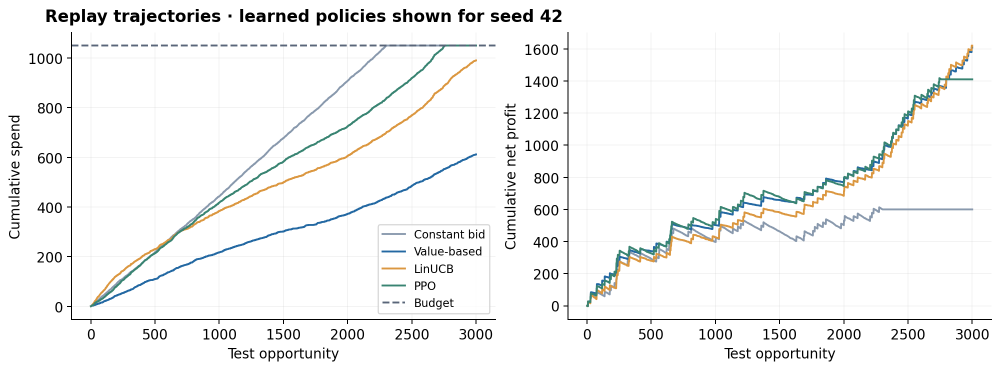

# Reproduced benchmark

Synthetic second-price auctions; these are simulated results, not production outcomes.

## Policy comparison

| Policy | Runs | Conversions (mean) | Spend (mean) | Net profit (mean ± SD) | Budget used |
|---|---:|---:|---:|---:|---:|
| Constant bid | 1 | 55.0 | 1049.90 | 600.10 ± 0.00 | 100.0% |
| Value-based | 1 | 74.0 | 611.69 | 1608.31 ± 0.00 | 58.3% |
| LinUCB | 3 | 83.3 | 1008.04 | 1491.96 ± 111.37 | 96.0% |
| PPO | 3 | 74.3 | 1049.86 | 1180.14 ± 398.46 | 100.0% |

SD describes policy-training randomness on ONE fixed holdout, not uncertainty across real markets. Fixed baselines are run once.
Net profit = conversions × 30 − spend under the default configuration. ROI = net profit / spend; no-spend ROI is undefined.

## Supervised models

CVR is evaluated only among clicked opportunities.

| Target | Model | Split | n | AUC | Log loss | Brier score |
|---|---|---|---:|---:|---:|---:|
| CTR | logistic | validation | 3000 | 0.6939 | 0.3617 | 0.1075 |
| CTR | boosted | validation | 3000 | 0.6694 | 0.3706 | 0.1100 |
| CVR | logistic | validation | 392 | 0.6850 | 0.5330 | 0.1761 |
| CVR | boosted | validation | 392 | 0.6562 | 0.5510 | 0.1838 |
| CTR | logistic | test | 3000 | 0.6781 | 0.3700 | 0.1098 |
| CVR | logistic | test | 403 | 0.6745 | 0.5514 | 0.1843 |

## Reproduction metadata

See [run_metadata.json](run_metadata.json) for seeds, split timestamps, dependency versions, data hashes and a source hash.
See [policy_results.csv](policy_results.csv) for every run, including underperforming policies.

